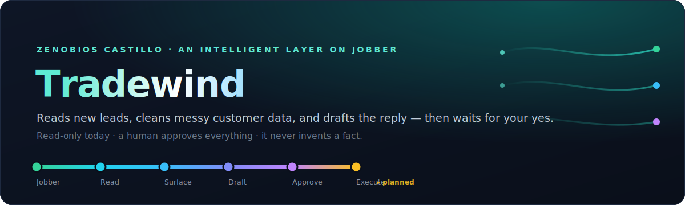

  

  
  
  
  
  

> **Private / internal.** This repository is Nerumi IP and must remain private.

Home-services businesses — plumbers, landscapers, fencing companies — run on **Jobber**, a CRM whose
funnel is *Request → Quote → Job → Invoice*. Their two recurring headaches: inbound leads slip through
the cracks, and customer records are messy (duplicates, half-filled). **Tradewind is an intelligent
layer that sits on top of Jobber** — it reads each new lead and the customer attached to it, flags
duplicate and incomplete records, and drafts a reply in the owner's voice. Then it **waits**. It never
changes data and never sends a message on its own; a human reviews and approves everything first.

> 📊 **Prefer an interactive page?** Open **[`docs/visual-guide.html`](docs/visual-guide.html)** in any
> browser — the same story as a single offline page (no setup). Everything below renders right here on GitHub.

---

## 🧭 What Tradewind is

Think of it as a sharp assistant who **prepares the work and hands it to the owner to sign off**, rather
than a bot let loose on the business. Three jobs, all read-only today:

- **Reads the leads** — picks up every new Jobber Request and the linked customer, automatically.
- **Ranks the leads** — scores each new lead by value & fit so the owner chases the right ones first, and politely defers the rest.
- **Cleans the data** — flags likely duplicate and incomplete client records for review.
- **Drafts the reply** — writes an email + text in the owner's voice, grounded in confirmed facts, held for approval.

---

## 🏗️ The architecture — WAT (Workflows · Agents · Tools)

The system deliberately separates *thinking* from *doing* — that separation is what makes it reliable.
If one AI tries to do every step, small errors compound (five 90%-accurate steps ≈ 59% success). So
judgment lives in one layer and exact execution in another.

  

- **Workflows** — plain-language playbooks describing each task, step by step.
- **Agent** — the AI. It reads the workflow and makes the judgment calls ("is this *likely* a duplicate?", "what should the reply say?").
- **Tools** — small, predictable Python scripts that do the exact, repeatable work.
- **Knowledge base** — the only place the Agent may get facts about the business. If a fact isn't there, it **escalates instead of guessing**.

---

## 🪜 The layers — built safest-first

Each layer is proven before the next is added. A lead flows top-to-bottom through the system:

  

| Layer | What it does | Status |
|-------|--------------|--------|
| **1 · Read & Surface** | Polls new Jobber Requests, reads the linked customer, flags likely **duplicates** and **incomplete** records, writes everything to a Google Sheet. | 🟢 **Built & verified** (read-only) |
| **2 · Draft & Propose** | Drafts a follow-up (email + SMS) grounded in the knowledge base, and proposes high-confidence cleanups (e.g. "merge these two duplicates"). Both land in the Sheet with an **approve / edit / reject** control. | 🟢 **Built & verified** (read-only) |
| **2.5 · Score & Prioritize** | Ranks each new lead 0–100 by source, job value, urgency, service-area fit and reachability into **hot / warm / cool / defer**, and queues a polite waitlist reply for the low-priority ones. Built for **capacity-constrained** owners who need to chase the right leads first. | 🟢 **Built** (read-only) |
| **3 · Execution** | Once the owner approves, actually send the message and apply the change in Jobber. | 🟠 **Planned — not built** |

> **Two honest caveats for review:**
> 1. **Everything built so far is strictly read-only** — Tradewind cannot currently change Jobber data or message anyone. The permissions are *read-only by construction.*
> 2. **Nothing has run on real customer data yet.** It's been validated end-to-end against a test sandbox and clearly-labeled **sample** data (see the demo). The plumbing, detection, drafting, and approval surface are all proven; a real-account run is the next milestone.

---

## 🛡️ The safety design

Trust is built into the structure, not bolted on. Four guarantees hold at every step:

- 🔒 **Least privilege** — the Jobber connection asks for *read-only* permission; there is no send/message capability anywhere in the code.
- 🧠 **Never invents facts** — every customer-facing claim must come from confirmed knowledge. A built-in **grounding gate** blocks any draft that cites an unconfirmed fact.
- ✅ **Approval gate** — drafts and proposals are surfaced with their sources and an approve / edit / reject control; the system never overwrites an owner's edits.
- 🧪 **Sample can't be sent** — demo knowledge is tagged as sample; drafts built on it are flagged so they can never be sent as if they were real, confirmed facts.

---

## 🎬 The GreenLeaf demo

To show the system without a live client, the knowledge base is filled with sample data for a made-up
landscaping company, **GreenLeaf Landscaping**. The same lead is run twice — the only thing that changes
the result is whether confirmed knowledge exists.

  

Identical input; the only thing that moved the draft from "escalate everything" to "ready to send" was
**confirmed knowledge**. That contrast *is* the reliability story.

> ⚠️ All `knowledge/` content is fictional **sample data** (clearly labeled `status: sample`) — GreenLeaf is **not a real business.**

---

## 🗺️ Roadmap

> **Why scoring exists.** Our first real market-validation interview — a business in the **fencing**
> trade — surfaced that these owners are *capacity-constrained, not lead-starved* ("lots of customers,
> can't take them all"; "most Facebook leads are trash"). They don't need *more* leads — they need to
> know *which* to chase fast vs. politely defer. That's the **Score & Prioritize** layer above, now
> built (read-only). *(See [`research/`](research/) for the anonymized discovery notes.)*

1. **Real-data onboarding.** The read-only pipeline (read · score · draft) is proven on a test sandbox
   and labeled sample data; the next milestone is a first run against a live Jobber account, where the
   owner tunes the scoring weights and confirms the knowledge base.
2. **Layer 3 — execution.** Approved drafts get sent and approved cleanups get applied in Jobber — the
   first capability that can change data or reach a customer, and therefore the most carefully gated.

---

## 🧑‍💻 For developers

- **[CLAUDE.md](CLAUDE.md)** — the architecture and the action-safety rules the agent operates under.
- **[workflows/](workflows/)** — the step-by-step SOPs: `ingest_and_surface.md` (Layer 1), `draft_and_propose.md` (Layer 2), `score_and_prioritize.md` (Score & Prioritize).
- **[tools/](tools/)** — the deterministic Python (Jobber reads, Sheet I/O, hygiene rules, the grounding gate, cleanup proposals, lead scoring).
- **[knowledge/](knowledge/)** — the owner-confirmed source of truth (currently GreenLeaf *sample* data).
- **[demo/](demo/)** — a runnable demo: `python demo/full.py` resets the Sheet and runs the whole read-only pipeline (ingest · hygiene · score · draft · propose) over synthetic GreenLeaf data. See [demo/README.md](demo/README.md).
- Secrets (`.env`, `credentials.json`, `*_token.json`) are **gitignored and never committed**; copy `.env.example` to `.env` and supply your own.

## License

Proprietary — Nerumi internal. Not for distribution.
